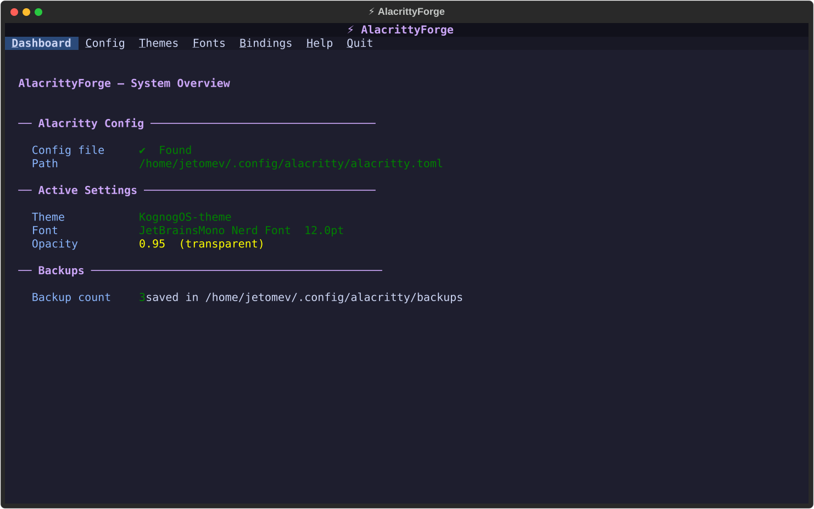
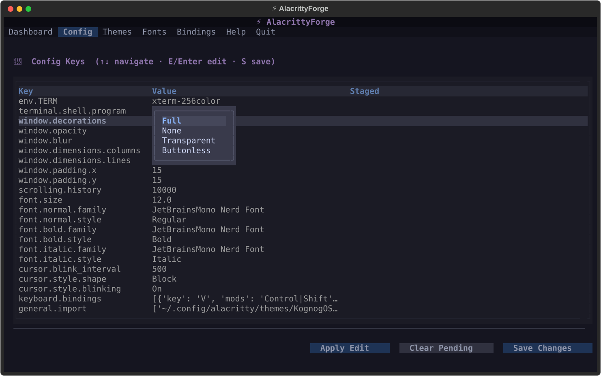
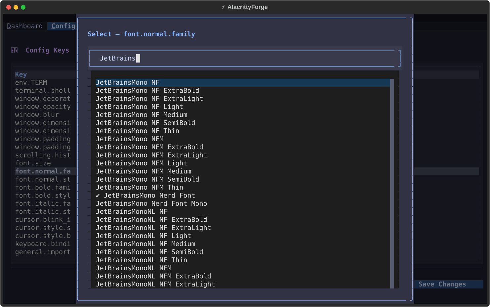
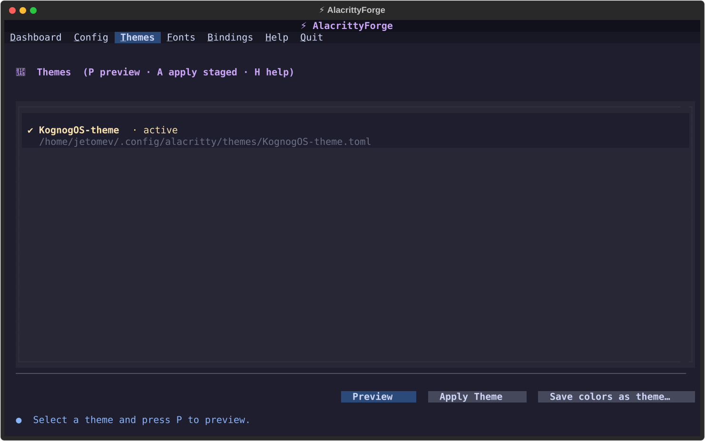
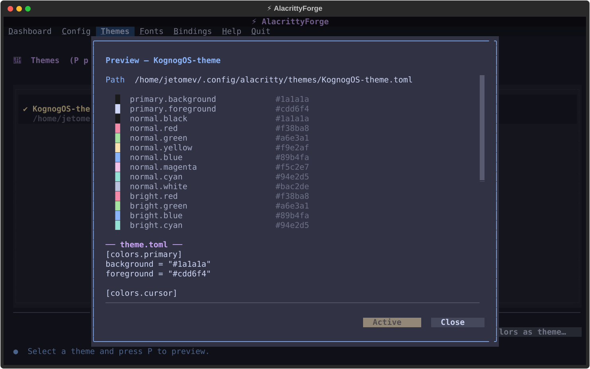
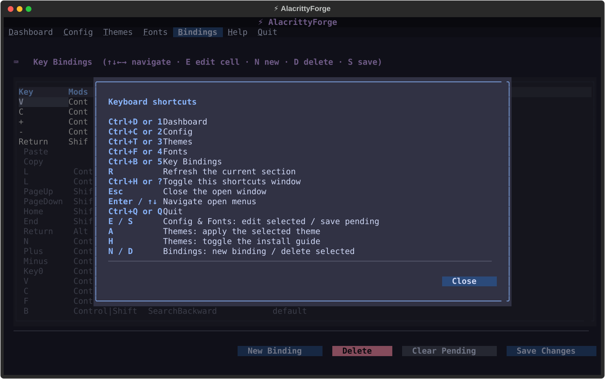

# ⚡ alacrittyForge

> A terminal application for configuring the Alacritty terminal emulator — safely, clearly, and beautifully.


[](https://aur.archlinux.org/packages/alacrittyforge)

> 🛡 **Security** — every release is GPG-signed and every commit is GitHub-Verified. **[Where We Stand](https://github.com/jetomev/KognogOS/blob/main/docs/where-we-stand.md)** covers our response to the 2026 AUR supply-chain attacks and how to check us yourself.

---

## Why alacrittyForge?

Alacritty is one of the fastest and most elegant terminals on Linux. But configuring it means opening a TOML file in a text editor, knowing exactly which settings and values are valid, and hoping you don't make a mistake that breaks your terminal.

There's no graphical settings window. There's no safety net.

**alacrittyForge exists to change that.** Configuring your terminal should be:

- **Safe** — a backup before every change, and a confirmation before every write
- **Clear** — settings explained in plain language and checked before they're saved
- **Good-looking** — a proper application, in the terminal it configures
- **Approachable** — keyboard-driven, fast, and usable if you just want your terminal to look right

---

## Features

Values are edited **where they live**. There's no separate form to fill in — you move to a setting in the table and change it in place.

- 🏠 **Dashboard** — your current setup at a glance: active theme, font, opacity, and how many backups you have
- 🔧 **Config** — one table of `Key | Value | Staged`. Settings with a fixed set of valid options open a **dropdown right at the cell**, so typos are impossible. Long lists open a **type-to-filter picker**. Anything free-form opens a small editor. Colour values show a live **■ swatch**.
- 🎨 **Themes** — preview before you commit. **Preview** opens a window showing the palette, **Activate** stages your choice without writing anything, and only **Apply** writes the file — after a confirmation and a backup.

  It understands **both ways Alacritty does themes**: separate theme files, and colours written directly into your config. If yours are inline, one click promotes them into a reusable theme file.
- 🔤 **Fonts** — the same table pattern, with a filterable picker listing the monospace fonts actually installed on your system
- ⌨ **Bindings** — edited cell by cell. Move across `Key | Mods | Action | Chars` and change each part with the right kind of editor. New bindings show in orange, deletions in struck-through red, and Alacritty's own defaults are shown read-only so you can see what you're overriding.
- 🗂 **Backup & Restore** — a timestamped backup before every change, kept in `~/.config/alacritty/backups/`

Nothing is written until you press **Save**. Staged changes are marked ⏳ so you always know what's pending.

---

## Screenshots

*Generated from the running app — `python docs/screenshots/generate.py` re-renders the gallery each release, so they never go stale.*

**Dashboard**


**Config — editing in place, with a dropdown at the cell**


**Config — the filterable font picker**


**Themes — preview and stage**


**Theme preview**


**Bindings — cell-level editing**


**Shortcuts**


---

## Requirements

- Linux, with Alacritty installed
- Python 3.11 or newer
- `python-textual`, `python-rich`, `python-tomli-w`
- [`forgekit`](https://github.com/jetomev/forgekit) 0.3.0 or newer — the shared foundation for Forge apps

---

## Installation

### Arch Linux, from the AUR (recommended)

```bash
yay -S alacrittyforge
```

Then run `alacrittyforge`.

### Arch Linux, from source

```bash
sudo pacman -S python-textual python-rich python-tomli-w
git clone https://github.com/jetomev/alacrittyforge.git
cd alacrittyforge
python main.py
```

### Other distributions

```bash
pip install textual rich tomli-w
git clone https://github.com/jetomev/alacrittyforge.git
cd alacrittyforge
python main.py
```

---

## Usage

```bash
alacrittyforge
```

> **No `sudo` needed.** alacrittyForge only ever writes to your own configuration at `~/.config/alacritty/alacritty.toml`, and its backups next to it.

---

## Keybindings

### Anywhere

| Key | Action |
|-----|--------|
| `Ctrl+D` or `1` | Dashboard |
| `Ctrl+C` or `2` | Config |
| `Ctrl+T` or `3` | Themes |
| `Ctrl+F` or `4` | Fonts |
| `Ctrl+B` or `5` | Bindings |
| `?` or `Ctrl+H` | Shortcuts window |
| `Esc` | Close the open window |
| `q` / `Ctrl+Q` | Quit |

### Config and Fonts

| Key | Action |
|-----|--------|
| `E` / `Enter` | Edit the selected value in place |
| `S` | Save everything staged (confirms, then backs up) |
| `R` | Reload from disk |

### Themes

| Key | Action |
|-----|--------|
| `P` / `Enter` | Preview the selected theme |
| `A` | Apply the staged theme |
| `H` | Installation guide |
| `F5` | Refresh the theme list |

### Bindings

| Key | Action |
|-----|--------|
| `←↑↓→` | Move between cells |
| `E` / `Enter` | Edit the cell under the cursor |
| `N` | Stage a new binding |
| `D` | Stage or unstage a deletion |
| `S` | Save everything staged |

---

## Project Structure

```
alacrittyforge/
├── main.py                        # Entry point
├── alacrittyforge/
│   ├── app.py                     # The application shell
│   ├── config_manager.py          # Reads, validates and writes the TOML config
│   ├── backup_manager.py          # Create, list, restore and delete backups
│   ├── theme_manager.py           # Finds themes, reads their colours, applies them
│   ├── font_manager.py            # Font settings
│   ├── keybind_manager.py         # Keybindings, including Alacritty's defaults
│   ├── field_options.py           # Which settings have fixed options, and what they are
│   ├── screens/                   # One file per section
│   └── widgets/                   # Status line and the filterable picker
├── docs/                          # Changelog, roadmap, screenshots
├── testing/                       # Test matrix and results per version
└── LICENSE
```

The menu bar, dialogs, theme and scrollbars come from [forgekit](https://github.com/jetomev/forgekit), shared across the Forge apps.

---

## Safety Philosophy

alacrittyForge is built around one rule: **never change your config without telling you.**

Every change passes three checks:

1. **Validation** — input is checked before it's staged
2. **Confirmation** — a dialog asks before anything is written
3. **Backup** — your current config is saved automatically first

Backups live in `~/.config/alacritty/backups/`, keeping the 20 most recent.

---

## Roadmap

### Next — v0.3.0

- [ ] **A colour picker** for hex colour fields (swatches shipped in v0.2.0)
- [ ] **A backup restore screen** — backups are created automatically, but restoring one still means doing it by hand
- [ ] **Notice when your config changed outside the app** — remember what we last wrote, and if the file no longer matches, offer to accept it, restore ours, or save its colours as a theme

### Later

- [ ] Live preview of font changes
- [ ] Import and export configuration profiles

### v0.2.0 — August 10, 2026 (current)

- [x] Rebuilt on [forgekit](https://github.com/jetomev/forgekit), the shared Forge foundation
- [x] Config: one-table in-place editing — dropdowns at the cell, filterable pickers, colour swatches, and a fixed footer where Save is the only thing that writes
- [x] Themes: preview-and-stage flow, support for **both** theming models, and one-click promotion of inline colours into a theme file
- [x] Fonts: the same table pattern, with a monospace-only picker (486 families on the test machine — the filter earns its keep)
- [x] Bindings: cell-level editing, with new, changed and deleted entries all saved together
- [x] Fixed a silent trap: colours written directly in your config quietly override an imported theme, so applying a theme now clears them

### v0.1.1 — May 2026

- [x] Staged edits survive switching screens
- [x] One consistent way of reporting what happened, across every screen
- [x] Help window toggles instead of stacking
- [x] Screen keys work as soon as you arrive, without clicking first
- [x] Confirmation dialogs: `Esc` cancels, `Enter` confirms
- [x] Published on the AUR

*Older entries live in [docs/ROADMAP.md](docs/ROADMAP.md).*

---

## Changelog

### v0.2.0 — August 10, 2026

**The forgekit redesign.** alacrittyForge became the second Forge app built on the shared foundation — and the release where the in-place editing style was invented.

The idea: one table per section, with values edited where they live. Settings with fixed options open a dropdown right at the cell, long lists open a filterable picker, free text opens a small editor. Staged changes are marked ⏳ in the table, and a fixed footer at the bottom holds the only button that writes anything.

Three rounds of hands-on review shaped it, and the shared foundation grew form styling and simpler window-closing along the way — improvements every other Forge app inherited.

One bug fixed here is worth calling out, because it's invisible until it bites you: colours written directly in `alacritty.toml` silently override any theme you import. You apply a theme, nothing appears to happen, and there's no error. Applying a theme now clears those inline colours first.

New dependency: [forgekit 0.3.0](https://github.com/jetomev/forgekit) or newer, packaged on the AUR as `python-forgekit`. `yay -S alacrittyforge` pulls it in for you.

### v0.1.1 — May 28, 2026

**A hardening batch**, closing six findings from an audit that borrowed grubForge's playbook.

- 🔒 **Staged edits stopped disappearing.** Switching away from a screen and back silently discarded everything you'd staged — the code that re-read from disk also reset the staging area. Reading and resetting are now separate things.
- 💬 **One feedback channel.** Every screen now reports through the same status line and toast, instead of five near-identical versions with their own inconsistent icons.
- ❓ **The help window stopped stacking.** Pressing `?` twice used to open two of them. It now toggles, and `Esc`, `q` or `?` all close it.
- 🎯 **Keys work on arrival.** Screen shortcuts used to be dead until you clicked into a panel first. Each screen now takes focus when you open it.
- ⌨ **Confirmation dialogs got keyboard-friendly** — `Esc` cancels, `Enter` confirms, no tabbing onto a button.

**Packaging:** published on the AUR. The build now launches the app headlessly as a check, so a styling or startup error is caught while building rather than when you first run it.

*The complete history lives in [docs/CHANGELOG.md](docs/CHANGELOG.md).*

---

## Related Projects

- **[KognogOS](https://github.com/jetomev/KognogOS)** — the distribution alacrittyForge ships with
- **[forgekit](https://github.com/jetomev/forgekit)** — the shared foundation for the Forge apps
- **[nog](https://github.com/jetomev/nog)** — tier-aware package manager
- **[grubForge](https://github.com/jetomev/grubforge)** — bootloader manager
- **[bitlaForge](https://github.com/jetomev/bitlaforge)** — solo Bitcoin mining, honestly framed

---

## Authors

**jetomev** — idea, vision, direction, testing

**Claude (Anthropic)** — co-developer, architecture, implementation

Built as a collaboration between a human with a good idea and an AI that helped bring it to life — one command at a time.

---

## License

alacrittyForge is free software, released under the **GNU General Public License v3.0**. See [LICENSE](LICENSE) for the full text.

---

## Contributing

Contributions are welcome — open an issue or a pull request.

If you find alacrittyForge useful, a star helps others find it.
