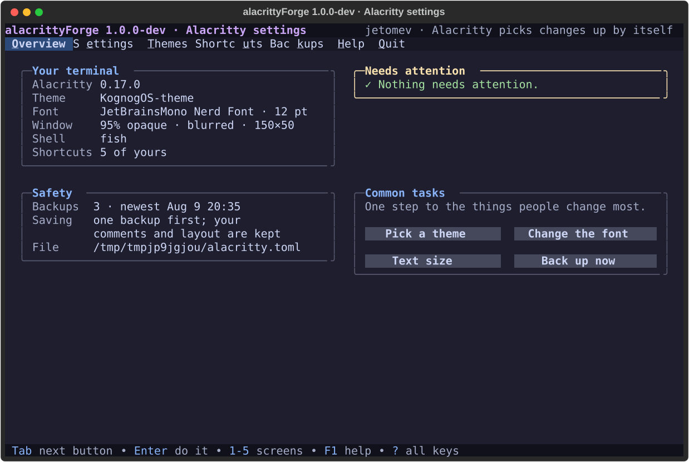
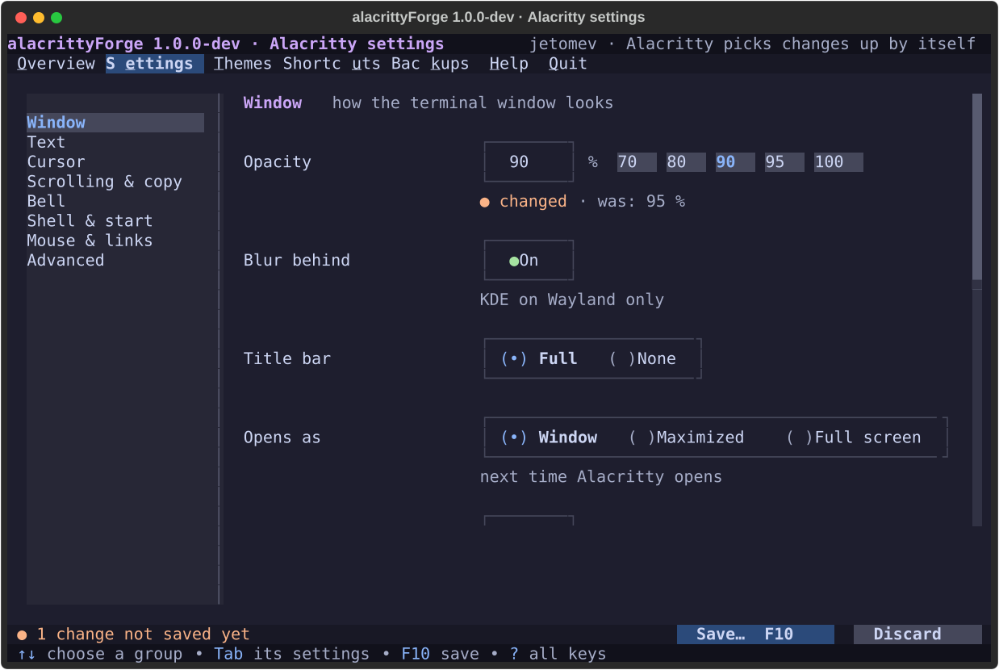
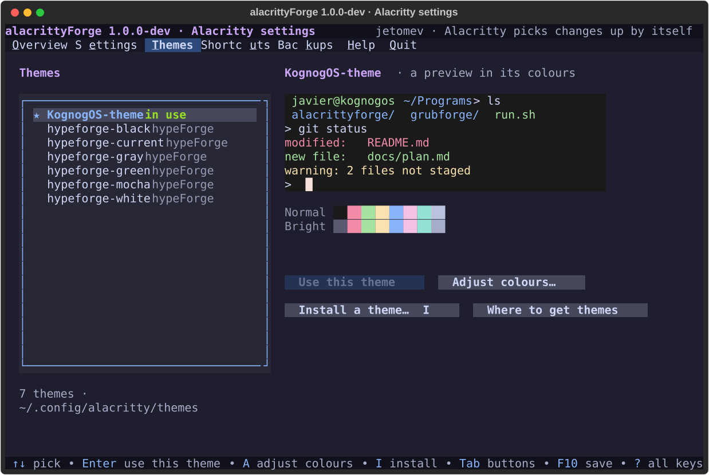
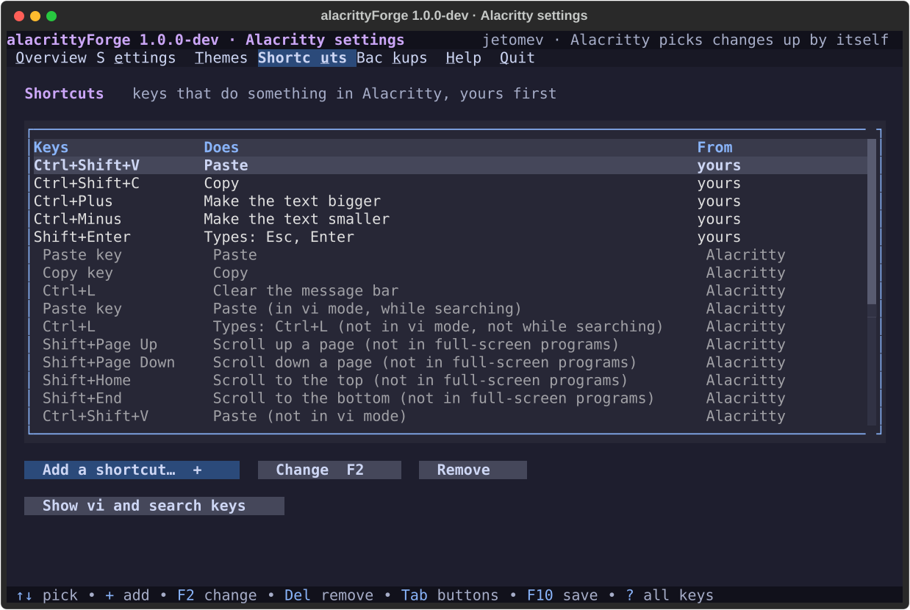
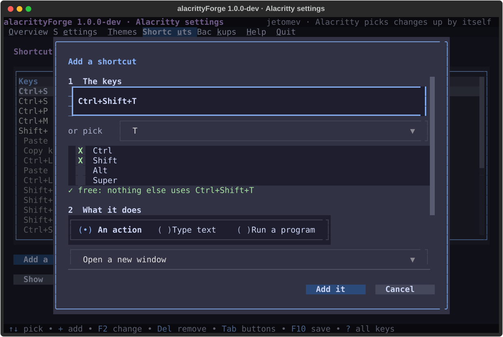
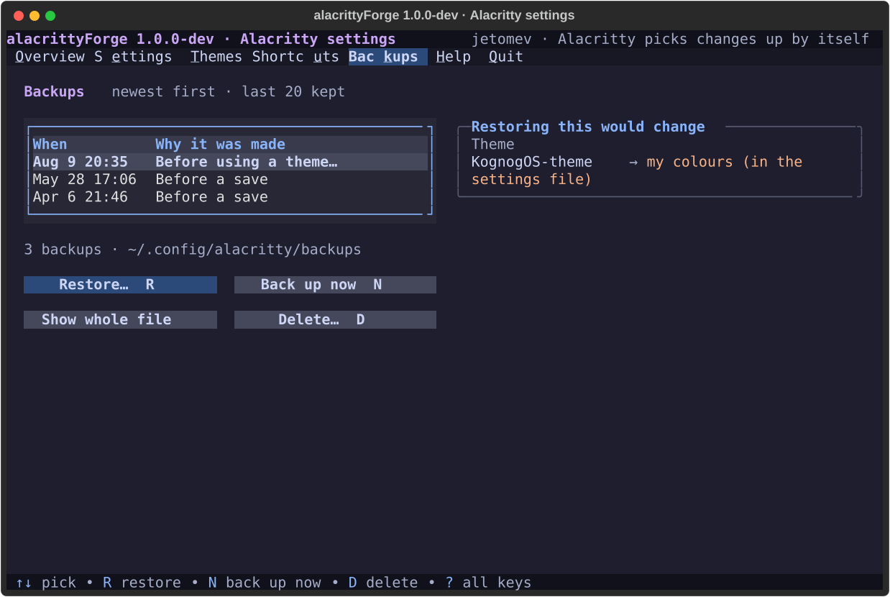
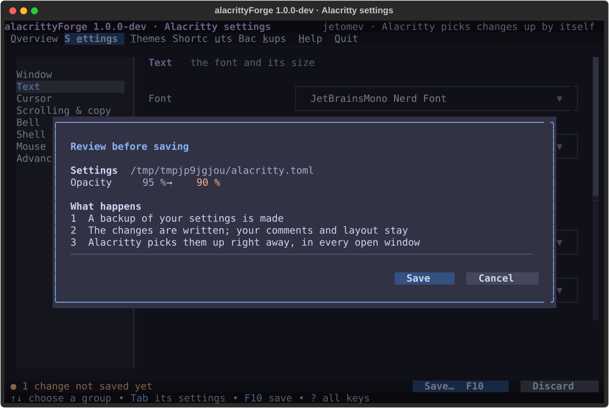

# ⚡ alacrittyForge

> Alacritty's settings, without editing the file by hand: every setting in plain words, picked from lists, reviewed before it's saved, with a backup first and your own notes kept.


[](https://aur.archlinux.org/packages/alacrittyforge)

> 🛡 **Security** — every release is GPG-signed and every commit is GitHub-Verified. **[Where We Stand](https://github.com/jetomev/KognogOS/blob/main/docs/where-we-stand.md)** covers our response to the 2026 AUR supply-chain attacks and how to check us yourself.

---

## Why alacrittyForge?

Alacritty is one of the fastest and most elegant terminals on Linux. But it has no settings window: you change it by editing a file, `~/.config/alacritty/alacritty.toml`, knowing which settings exist and which values they take.

**alacrittyForge is that settings window, in the terminal.** It should be:

- **Safe**: a review of every change before it's saved, one backup first, and the file written in one step, so it is never left half-written
- **Respectful**: your own notes and layout in the file stay; only the settings you change are touched
- **Clear**: every setting in plain words, with Alacritty's own name in the help line for those who want it
- **Easy**: known values are picked from lists and presets; you type only names and the odd number

---

## Features

- 🏠 **Overview**: "is my terminal set up right?" in four boxes. Anything that needs attention comes with the button that fixes it: a file that can't be read, settings with old names, misspelled settings, no font installed.
- 🔧 **Settings**: every Alacritty setting on Linux, in eight groups (Window, Text, Cursor, Scrolling & copy, Bell, Shell & start, Mouse & links, Advanced). Presets for numbers, worded switches, fonts and shells from your computer. A setting you haven't set shows what Alacritty does instead.
- 🎨 **Themes**: a preview of a terminal in each theme's colours. **Adjust colours** makes your own copy; themes another tool maintains (hypeForge's) stay locked; install theme files safely.
- ⌨ **Shortcuts**: every shortcut in words ("Make the text bigger"). Add one by **pressing its keys**; turn off any of Alacritty's own.
- 🗂 **Backups**: why each was made, and what restoring it would change, before you do.
- 💾 **Save with a review**: **F10** shows every change, old → new. Alacritty picks the change up straight away, in every open window.
- 📖 **A manual inside the app** (**M**), and **F1** on any setting opens its page.
- 🐧 **Every major distribution**: alacrittyForge writes the setting names your Alacritty reads. Ubuntu 24.04 ships Alacritty 0.13, which uses older names than Debian, Fedora, openSUSE and Arch.
- 🖥 **Readable on a plain text console**, and nothing cut off at 100 columns.
- 🌙 **Catppuccin Mocha**, on [forgekit](https://github.com/jetomev/forgekit), the Forge Suite's shared base.

---

## Screenshots

### Overview


### Settings


### Themes


### Shortcuts, and adding one by pressing its keys



### Backups


### Review before saving


---

## Requirements

- Linux, with **Alacritty 0.13 or newer** (alacrittyForge reads `alacritty --version` and writes the names that version reads)
- Python 3.11 or newer
- `python-textual`, `python-rich`, `python-tomlkit` and [`python-forgekit`](https://github.com/jetomev/forgekit) 0.5.1 or newer
- `fontconfig` (`fc-list`), to list your fonts

---

## Installation

### Arch Linux and KognogOS, from the AUR (recommended)

```bash
nog install alacrittyforge      # KognogOS
yay -S alacrittyforge           # any AUR helper
```

### Any other distribution

```bash
git clone https://github.com/jetomev/alacrittyforge.git
git clone https://github.com/jetomev/forgekit.git
cd alacrittyforge
python3 -m venv .venv && .venv/bin/pip install textual rich tomlkit
PYTHONPATH=../forgekit .venv/bin/python main.py
```

A virtual environment is used because most current distributions refuse `pip install` into the system Python. If yours packages `textual`, `rich` and `tomlkit`, prefer those.

| Distribution | Alacritty | Tested in a VM |
|---|---|---|
| Arch, KognogOS | 0.17 | KognogOS |
| Fedora 44 | 0.17 | yes |
| openSUSE Tumbleweed | 0.17 | yes |
| Debian 13 | 0.15 | yes |
| Ubuntu 24.04 | 0.13 (older setting names) | yes |

In each, alacrittyForge's tests ran, and that distribution's own Alacritty read a file alacrittyForge had saved without a single warning.

---

## Usage

```bash
alacrittyforge              # open alacrittyForge
alacrittyforge --version    # print the version
alacrittyforge --help       # print the usage
```

No `sudo`: alacrittyForge only changes your own files.

When it closes, the terminal gets a short record: what you saved, the newest backup, where the run was logged (`~/.local/share/alacrittyforge/logs/`), and a thank-you.

---

## Keys

| Key | Does |
|---|---|
| Tab / Shift+Tab | next / previous field or button |
| Enter | open a list, press a button, confirm |
| Space | flip a switch |
| ↑ ↓ in a number | step through its presets |
| Esc | close a window |
| 1 – 5, or Ctrl + the underlined letter | Overview, Settings, Themes, Shortcuts, Backups |
| F10, or S | save, with a review first |
| R | read the file again (your unsaved changes stay) |
| F1 | help on what is selected |
| M | the manual |
| ? | all keys |
| Q, or Ctrl+Q | quit (asks first if something isn't saved) |

In Themes: **Enter** uses a theme, **A** adjusts its colours, **I** installs one. In Shortcuts: **+** adds, **F2** changes, **Delete** removes. In Backups: **R** restores, **N** backs up now, **D** deletes. Letter keys never act while you're typing in a field.

The full manual is in [`alacrittyforge/manual/`](alacrittyforge/manual/), and inside the app with **M**.

---

## Safety

1. **Review**: before anything is written you see every change as old → new.
2. **Backup**: the settings file is copied first: one backup per save, the newest 20 kept in `~/.config/alacritty/backups/`.
3. **A careful write**: only the settings you changed are touched; your notes and layout stay. The new file is checked, written next to the old one and swapped in, so a crash leaves the old file or the new one, never half of one. A settings file that's a link (dotfiles) stays a link.
4. **Never over a broken file**: if the file can't be read, alacrittyForge says why and offers the newest backup instead of saving over it.

Themes are only ever *added*, never written over. Files another tool maintains (hypeForge's themes) are never changed.

---

## How this project is built

A human and AI collaboration. The 1.0 redesign was drawn screen by screen and approved before any code was written: [`docs/design/v1.0.0-screens.html`](docs/design/v1.0.0-screens.html). The `testing/` folder holds the test matrices, published on purpose.

---

## Roadmap

### Next

- [ ] Edit the hints (which text on screen can be opened with Ctrl+Shift+O) ([#16](https://github.com/jetomev/alacrittyforge/issues/16))
- [ ] Mouse shortcuts, alongside the keyboard ones ([#17](https://github.com/jetomev/alacrittyforge/issues/17))

### Done

- [x] **v1.0.0** ([#8](https://github.com/jetomev/alacrittyforge/issues/8)): rebuilt to match grubForge 2.0; safe saving that keeps your notes; every setting; shortcuts recorded by pressing keys; backups you can restore; every major distribution
- [x] **v0.2.0**: rebuilt on forgekit, in-place editing
- [x] Earlier releases: [docs/ROADMAP.md](docs/ROADMAP.md)

---

## Changelog

### v1.0.0 — October 2, 2026

**alacrittyForge, rebuilt, and safe.** Every screen was redesigned to match grubForge 2.0, from a plan Javier approved screen by screen before any code was written. Taking stock of 0.2.0 first found four ways it could damage your settings; all are fixed, each with a test.

- 💾 **Saving is safe now.** A save touches only the settings you changed; your notes and layout stay. A cleared setting no longer breaks the save. A file that can't be read is never saved over. One backup per save (0.2.0 made one per shortcut change, which could push out all your older backups). The file is written in one step, links are followed.
- 🔧 **Every setting**, about 60 on Linux, in plain words, with presets and lists; settings you haven't set say what Alacritty does instead.
- 🎨 **Themes** with a preview, **Adjust colours** (your own copy), hypeForge's themes locked, safe installs.
- ⌨ **Shortcuts in words**, recorded by pressing the keys; Alacritty's own can be turned off. Every part of a shortcut is kept when it's changed.
- 🗂 **Backups**: what restoring would change; restore and delete ask first. Backups are dated when they were made (0.2.0 showed your settings' last edit).
- 🐧 **Every major distribution**: writes the names your Alacritty reads (Ubuntu 24.04's 0.13 uses older ones); tested in Ubuntu, Debian, Fedora and openSUSE VMs with each one's own Alacritty.
- 📖 A manual inside the app, `--version` and `--help`, a closing note in the terminal, readable on a text console.

Found and fixed on the way, each with an issue: [#9](https://github.com/jetomev/alacrittyforge/issues/9)–[#15](https://github.com/jetomev/alacrittyforge/issues/15). Tested by Javier on KognogOS as a package upgrade from 0.2.0: *"a beautiful piece of software"*. Tests: 0 → **80**; warnings 0. New dependency: `python-tomlkit`; `python-forgekit` ≥ 0.5.1; no longer `python-tomli-w`.

### v0.2.0 — August 10, 2026

**The forgekit redesign.** alacrittyForge became the second Forge app built on the shared foundation, and the release where the in-place editing style was invented: one table per section, values edited where they live, staged changes marked, one Save. Applying a theme now cleared colours written straight into the settings file, which silently override any theme.

*The complete history lives in [docs/CHANGELOG.md](docs/CHANGELOG.md).*

---

## Related Projects

- **[KognogOS](https://github.com/jetomev/KognogOS)**: the distribution alacrittyForge ships with
- **[forgekit](https://github.com/jetomev/forgekit)**: the shared foundation for the Forge apps
- **[nog](https://github.com/jetomev/nog)**: tier-aware package manager
- **[grubForge](https://github.com/jetomev/grubforge)**: bootloader manager
- **[bitlaForge](https://github.com/jetomev/bitlaforge)**: solo Bitcoin mining, honestly framed

---

## Authors

**jetomev**: idea, vision, direction, testing

**Claude (Anthropic)**: co-developer, architecture, implementation

Built as a collaboration between a human with a good idea and an AI that helped bring it to life.

---

## License

alacrittyForge is free software, released under the **GNU General Public License v3.0**. See [LICENSE](LICENSE) for the full text.

---

## Contributing

Contributions are welcome: open an issue or a pull request. Bug reports are genuinely valued.

If you find alacrittyForge useful, a star helps others find it.
